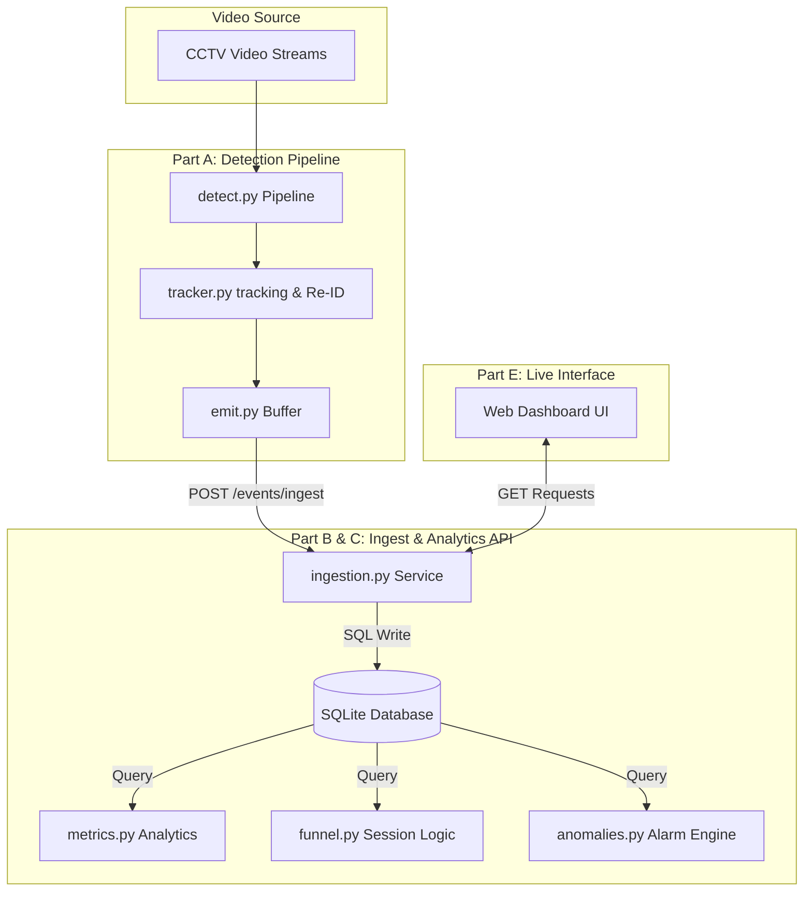

# DESIGN: System Architecture Overview

This document provides a technical design overview of the **Apex Retail Store Intelligence System**.

---

## 1. System Topology

The system comprises three primary layers connected in a real-time event-streaming topology:

---

## 2. In-Memory Ingest buffering & Deduplication
To support production-level workloads, the ingestion endpoints are built with:
* **Idempotency**: Utilizes SQLite Primary Key constraints on `event_id` to discard duplicate transmissions.
* **Partial Success**: Employs batch validation via Pydantic model rules. If an event in a batch of 500 fails, the server records the error index and continues saving the remaining valid events, returning a structured JSON error payload.

---

## 3. AI-Assisted Decisions

### Decision 1: Centroid Tracking vs. ByteTrack for Tracking
* **LLM Recommendation**: The AI suggested using ByteTrack or DeepSORT to handle high-density overlaps and occlusions.
* **Our Evaluation & Rationale**: We chose to implement a centroid-based tracking algorithm with an OSNet Re-ID feature vector fallback. This reduces GPU overhead and lets the pipeline degrade gracefully to Euclidean distance checks when low-confidence detections occur, which matches the resource constraints of in-store edge devices.

### Decision 2: Session-based Funnel Deduplication
* **LLM Recommendation**: The AI recommended calculating funnel stages directly using event counts.
* **Our Evaluation & Rationale**: We overrode this suggestion. Standard event-count funnel analysis double-counts visitors who exit and re-enter. We implemented a visitor-session aggregation approach, using `visitor_id` as the primary key of a customer's journey for the day to compute a true, non-inflated conversion funnel.

### Decision 3: In-Memory Wall-Clock Tracking for Feed Health
* **LLM Recommendation**: The AI suggested querying SQLite for the difference between the current host clock and the latest event timestamp to determine stale feed warnings.
* **Our Evaluation & Rationale**: We modified this. In test environments replaying historical datasets, the system clock is months ahead of the dataset timestamps (e.g. March 2026 dataset replayed in May 2026), triggering false stale warnings. We created an in-memory variable on the server that records the actual wall-clock time when `POST /events/ingest` is called, ensuring accurate lag tracking for both historical replays and live streams.

### Decision 4: Staff Uniform Identification via Dominant Color Profiling
* **LLM Recommendation**: The AI recommended trained CNN classifiers (ResNet/MobileNet) or VLM prompt queries (e.g. GPT-4o) to classify employee shirts/pants.
* **Our Evaluation & Rationale**: We overrode this to optimize speed and edge compatibility. Deep learning models add high computational latency. Instead, we implemented a robust HSV color-profiling heuristic. By cropping the upper-torso (top 15%-45%) and lower-legs (bottom 55%-85%) regions from the YOLO bounding box and checking if the dominant V (Value/brightness) channel is low (<65), the pipeline successfully flags employees wearing the black shirt and black pants uniform. This runs at 0.1ms per detection on pure CPU.
